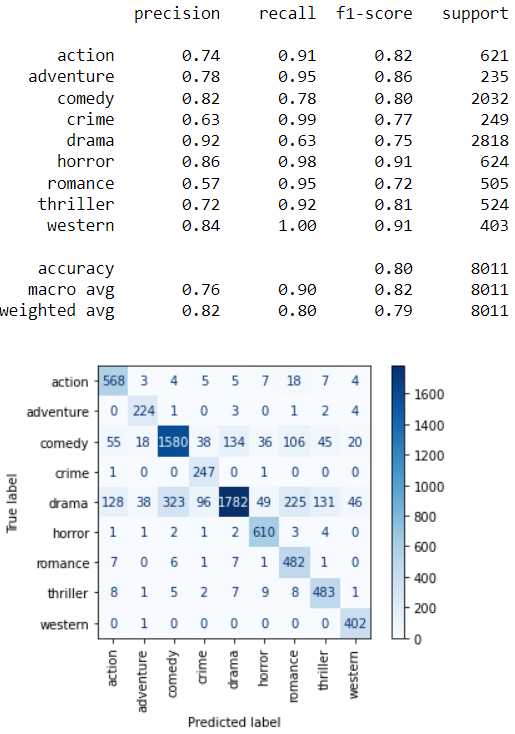
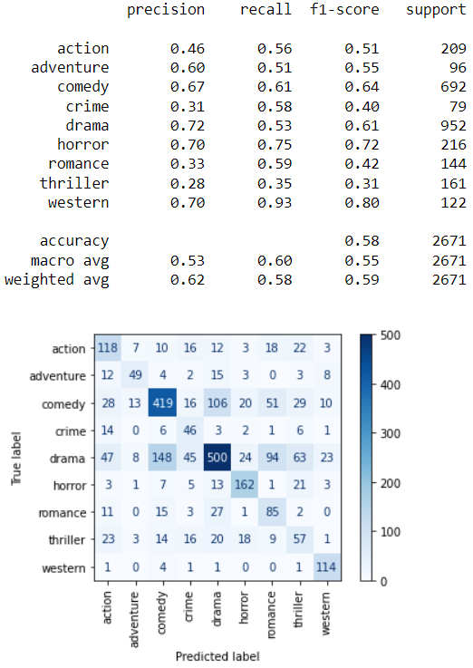
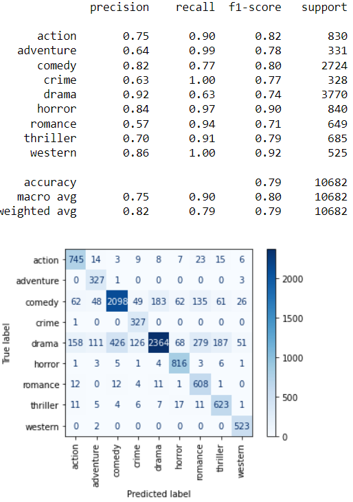

# Film-Genre-Identification-System

###Project Overview

The goal of this project is to create a film genre identification system using natural language processing (NLP). 
My data set consists of over 10,000 films. The data includes the year the film was made, the title of the film, a plot summary, the director, the acting leads and the genre. The data was provided by my instructor in my data science bootcamp. 
A variety of machine learning models have been used to generate the best results.

###Business Case

With the rise of online streaming platforms that contain vast collections of films and television series, there is a need to be able to automatically assign genres, in the case that they are missing, so that accurate recommendations can be made to the consumer. 

###The Repo

All of the data cleaning, exploratory analysis and modeling can be found in the film_genre_identification_notebook. Each section of the notebook is labelled. The predictions can be found in the genre_predictions.csv file.

###Data Cleaning

The model is only looking at the plot descriptions, not the release year, director or cast.
The only cleaning step required was to replace some missing cast information with 'unknown'.
No further cleaning was required.

###Data Preparation

I used NLTK to prepare my data for the modeling steps. My data exploration revealed that the titles span the history of film and include titles from many different countries, most notably India.

###Modeling

I trained my initial models on 75% of the data.
I used Logistic Regression, Multinomial Naive Bayes, a Random Forest Classifier and a Voting Classifier.
For Logistic Regression and Multinomial Naive Bayes, I used both simple piplines and pipelines combined with gridsearch to generate the best results.
I achieved my best results with a simple Logistic Regression model. While this model had the lowest variance, there was still significant variance between the training and test sets. 

Training model

Testing model

Model applied to entire data set

I attributed this to the fact that not all films fit neatly into a signle genre.

